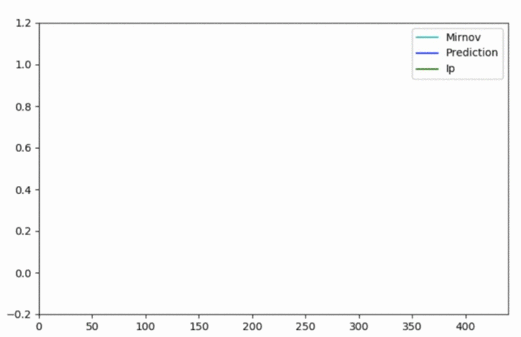
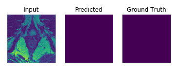

## About Me

B.Tech in Computer Engineer from Nirma University, Ahmedabad, India. I have been working in the field of Artificial Intelligence and Machine Learning from past 3 years, having experience in projects involving Computer Vision, Agriculture, Nuclear Physics, Parallel Computing, Medical Imaging, Satellite Imagery, and Audio Signal Processing. Besides the academic activities, I am very passionate about Body Building and Fitness.

## Research Interest

Application of Deep Learning and Computer Vision in the domain of Medical Imaging, Nuclear Physics, and Signal Processing.

## Volunteering Experience
- **Teaching Assistant**, Nvidia DLI Workshop: For courses on Computer Vision, DL for multiple data types and CUDA programming under [Dr. Priyanka Sharma](https://www.linkedin.com/in/drpriyankasharma/) at Mahindra École Centrale, Hyderabad, India.

## Publications
- Agarwal, A., Mishra, A., Sharma, P., Jain, S., Ranjan, S. and Manchanda, R., 2020. [Using LSTM for the Prediction of Disruption in ADITYA Tokamak](https://arxiv.org/abs/2007.06230). arXiv preprint arXiv:2007.06230.
- Agarwal, A., Mishra, A., Sharma, P., 2020. [DV-Net: An Enhanced Fully Convolutional Network for Volumetric Prostate Segmentation from Magnetic Resonance Imaging](http://grand-challenge-public.s3.amazonaws.com/evaluation-supplementary/40/0eee0725-be00-436c-9680-f2a234d2b1f2/Prostate_Segmenta_YQxkwBU.pdf). Submitted to Pattern Recognition and Image Analysis, Springer.

## Research

#### Predicting the dynamics of Tokamak discharge   (Department of Atomic Energy, India)  [[arXiv]](https://arxiv.org/abs/2007.06230)
- The aim of the research was to anticipate the phenomenon of Disruption during Plasma confinement in Aditya Tokamak.
- We were able to anticipate the disruption of plasma current 12ms prior to the actual disruption (4ms earlier than the state-of-the-art models).
- The model was developed in Tensorflow using LSTM, and was successfully tested, giving real time inferencing with an accuracy of 95%.
- Input features included the readings of various diagnostics like plasma current, mirnov oscillations, loop voltage, bolo meter readings and many other.

 
Our model predicting the disruption of Plasma current (12ms ahead) in real time.

#### 3D Prostate Segmentation of MR Images using FCNN [[code]](https://github.com/amanbasu/3d-prostate-segmentation) [[pdf]](http://grand-challenge-public.s3.amazonaws.com/evaluation-supplementary/40/0eee0725-be00-436c-9680-f2a234d2b1f2/Prostate_Segmenta_YQxkwBU.pdf)
- Segmentation of prostate from MRI considering 3D volume.
- Our model outperformed the results of V-net architecture in PROMISE12 challenge.
- [Poster](https://github.com/amanbasu/3d-prostate-segmentation/blob/master/images/Deep%20Learning%20Research_20_P9190_Aman_Agarwal_1920x1607.png) presented at Nvidia GTC 2019.

 

#### AmSat: A holistic system to classify temporal satellite imagery
- Temporal images were taken from Sentinel 2 satellite and a labeled dataset for classification was prepared.
- A customized I3D Inception network (3DCNN) was trained with heavy data augmentation methods to compensate for a very small dataset.
- The model was trained on AWS EC2 instance giving a validation accuracy of 85%.

#### Analysis of crop health
- Detection of crop species and diseases using image data.
- Predicting severity of the disease using the above information along with other parameters like soil, weather, region etc.

#### Speech Emotion Recognition [[code]](https://github.com/amanbasu/speech-emotion-recognition)
- Prediction of human emotions from raw audio using IEMOCAP database.
- Bidirectional LSTM was used along with local attention mechanism to focus on the part of speech which influence the emotion more.
- The architecture was trained on NVIDIA K80 system and gave results comparable to the state-of-the-art models.

#### Autonomous Car [[code]](https://github.com/amanbasu/Autonomous-Car-Prototype)
- A self-driving RC car which maneuvered itself on an indoor, hand-made track.
- Convolutional Neural Network was used to classify the direction of car from dashcam images.
- The model was able to achieve a classifying accuracy of 94%.

## Other Projects

#### Breaking Bill [[code]](https://github.com/amanbasu/Breaking-Bill)
- Android application to add expenses to a list along with the members who share it.
- Users can generate bills and split monthly expenses among members according to their contributions.

#### File Sender Application [[code]](https://github.com/amanbasu/Wifi-P2p)
- An android application to send files from one android device to another.
- The application used wifi direct and socket programming.
- It was capable to sharing any type of file format like image, audio, video, text, pdf, doc, xls etc.

#### Hospital Management System [[code]](https://github.com/amanbasu/hospital-management-system)
- A software developed on JavaFx to store hospital details like patient information, staff information, department details etc. in SQL database.

## Blogs
- [Ship Detection in Satellite Images from Scratch](https://medium.com/intel-software-innovators/ship-detection-in-satellite-images-from-scratch-849ccfcc3072)
- [ECG to Identify Individuals](https://medium.com/intel-software-innovators/ecg-to-identify-individuals-from-data-to-deployment-74cce404f9f0)
- [To be a Solutions Architect](https://medium.com/@amanag.11/to-be-a-solutions-architect-3990135ac2fe)

## Certifications and Courses
- AWS Certified Solutions Architect - Associate
- PCAP Certified Associate in Python Programming
- Deep Learning Specialization (5 courses), Prof. Andrew Ng.
- Machine Learning by Stanford University, Prof. Andrew Ng.
- Introduction to Big Data by University of California San Diego.
- Fundamentals of Accelerated Computing with CUDA, by Nvidia.
- Computer Vision Specialization by University of Buffalo.

## Achievements
- Poster presentation at **Nvidia GTC** (2019)
- Most Innovative Idea award at HSBC global graduates hackathon (2019)

 

## Hobbies & Interests
- Body Building and Cooking.
- Health & Nutrition.
- Human Anatomy.
- Cricket, badminton.
