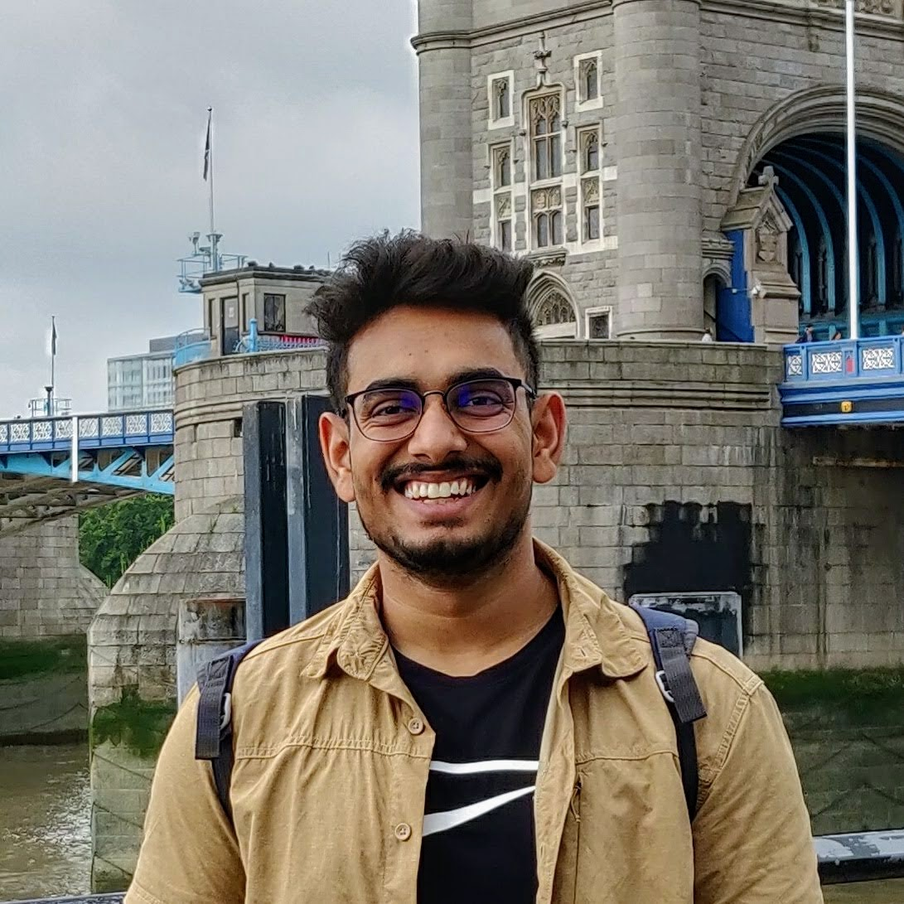

Hello World!  

  I am a Software Engineer at HSBC Technology India. I did my undergraduate in Computer Engineering from Nirma University, Ahmedabad, India. I have been working in the field of Artificial Intelligence and Machine Learning from past 3 years, having experience in projects involving Computer Vision, Medical Imaging, Satellite Imagery, Signal Processing, Nuclear Physics, and Parallel Computing.

*I am very passionate about Body Building and Fitness.*

## Research Interest
Application of Deep Learning and Computer Vision in the domain of Medical Imaging, Nuclear Physics, and Signal Processing.

## Volunteering Experience
- **Teaching Assistant** for Nvidia DLI Workshop - topics on Computer Vision, DL for multiple data types, and CUDA programming under <a target="_blank" href="https://technology.nirmauni.ac.in/author/priyanka/">Dr. Priyanka Sharma</a> at Mahindra École Centrale, Hyderabad, India.

## Publications

#### Journal
- **Using LSTM for the Prediction of Disruption in ADITYA Tokamak.**  
Aman Agarwal, Aditya Mishra, Priyanka Sharma, Swati Jain, Sutapa Ranjan, and Ranjana Manchanda.  
*Physics of Plasmas, AIP, 2020.* [[arXiv](https://arxiv.org/abs/2007.06230)]
- **DV-Net: An Enhanced Fully Convolutional Network for Volumetric Prostate Segmentation from Magnetic Resonance Imaging.**  
Aman Agarwal, Aditya Mishra, Priyanka Sharma, Madhushree Basavarajaiah, and Sudeep Tanwar.  
*Pattern Recognition and Image Analysis, Springer, 2020.* [[preprint](http://grand-challenge-public.s3.amazonaws.com/evaluation-supplementary/40/0eee0725-be00-436c-9680-f2a234d2b1f2/Prostate_Segmenta_YQxkwBU.pdf)]

#### Poster
- **P9190: Volumetric Prostate Segmentation from MRI using FCNN.**  
Aman Agarwal, Aditya Mishra, and Priyanka Sharma.  
*Nvidia GTC, San Jose, 2019.* [[poster](img/Deep%20Learning%20Research_20_P9190_Aman_Agarwal_1920x1607.png)]

## Projects

### Predicting the dynamics of Tokamak discharge [[arXiv](https://arxiv.org/abs/2007.06230)]   (Department of Atomic Energy, India)
- The aim of the project was to anticipate the phenomenon of Disruption during Plasma confinement inside ADITYA Tokamak.
- We were able to anticipate the disruption of plasma 12ms prior to the actual disruption (4ms earlier than the state-of-the-art models).
- Input features included the readings of various diagnostics like plasma current, mirnov oscillations, loop voltage, bolo meter, and many other.

 
Our model predicting the disruption of Plasma current (12ms ahead) in real time.

### 3D Prostate Segmentation of MR Images using FCNN [[code](https://github.com/amanbasu/3d-prostate-segmentation)] [[pdf](http://grand-challenge-public.s3.amazonaws.com/evaluation-supplementary/40/0eee0725-be00-436c-9680-f2a234d2b1f2/Prostate_Segmenta_YQxkwBU.pdf)]
- Our enhanced V-Net model outperformed the results of the baseline V-Net in PROMISE12 challenge.
- The model was enhanced by tweaking its architecture, adding dilation and deep supervision. We improved the accuracy by 6% points.

 

### AmSat: A holistic system to classify temporal satellite imagery
- An algorithm to detect the construction activity from temporal satellite images.
- Temporal images were taken from Planet satellite and a labeled dataset for classification was prepared.
- A customized I3D Inception network (3DCNN) was trained on just 24 samples, giving accuracy of 85% on a test set of 21 samples.

### Speech Emotion Recognition [[code](https://github.com/amanbasu/speech-emotion-recognition)]
- Prediction of human emotions from raw audio using IEMOCAP database.
- Bidirectional LSTM was used along with local attention mechanism to focus on the part of speech which influence the emotion more.
- The architecture was trained on NVIDIA K80 system and gave results comparable to the state-of-the-art models.

### Autonomous Car [[code](https://github.com/amanbasu/Autonomous-Car-Prototype)]
- A self-driving RC car that can maneuver itself on an indoor, hand-made track.
- Convolutional Neural Network was used to classify the direction of car from dashcam images.
- The model was deployed on Raspberry Pi for real-time predictions.

### Analysis of crop health
- Detection of crop species and diseases using image data.
- Predicting the severity of disease using the image along with other parameters like soil, weather, region etc.
- Trained the network using a modified loss function, taking two classes into account, specie and disease.

<!--
## Other Projects
<!--
#### Breaking Bill [[code](https://github.com/amanbasu/Breaking-Bill)]
- Android application to add expenses to a list along with the members who share it.
- Users can generate bills and split monthly expenses among members according to their contributions.
<!--
#### File Sender Application [[code](https://github.com/amanbasu/Wifi-P2p)]
- An android application to send files from one android device to another.
- The application used wifi direct and socket programming.
- It was capable to sharing any type of file format like image, audio, video, text, pdf, doc, xls etc.
<!--
#### Hospital Management System [[code](https://github.com/amanbasu/hospital-management-system)]
- A software developed on JavaFx to store hospital details like patient information, staff information, department details etc. in SQL database. 
-->

<!--
## Blog Posts
- [Ship Detection in Satellite Images from Scratch](https://medium.com/intel-software-innovators/ship-detection-in-satellite-images-from-scratch-849ccfcc3072): detecting ships in satellite images using Yolo-v3 network.
- [ECG to Identify Individuals](https://medium.com/intel-software-innovators/ecg-to-identify-individuals-from-data-to-deployment-74cce404f9f0): using ECG signals to authenticate an individual by a siamese network.
- [To be a Solutions Architect](https://medium.com/@amanag.11/to-be-a-solutions-architect-3990135ac2fe): a guide to the AWS Certified Solutions Architect Associate exam.

<!--
## Certifications and Courses
- [AWS Certified Solutions Architect - Associate](https://www.youracclaim.com/badges/ba0dc25c-3b38-4b27-878a-639eb0d888bc/public_url)
- [PCAP Certified Associate in Python Programming](https://www.youracclaim.com/badges/32c3c723-97d9-444f-bea6-5e766e5394d6/public_url)
- Deep Learning Specialization (5 courses), Prof. Andrew Ng.
- Machine Learning by Stanford University, Prof. Andrew Ng.
- Introduction to Big Data by University of California San Diego.
- Fundamentals of Accelerated Computing with CUDA, by Nvidia.
- Computer Vision Specialization by University of Buffalo.

<!--
## Achievements
- Poster presentation at **Nvidia GTC** (2019) [[poster](img/Deep%20Learning%20Research_20_P9190_Aman_Agarwal_1920x1607.png)]
- **Most Innovative Idea** award at HSBC global graduates hackathon (2019) [[blog](https://medium.com/intel-software-innovators/ecg-to-identify-individuals-from-data-to-deployment-74cce404f9f0)]

<!--
## Hobbies & Interests
- Body Building and Cooking.
- Health & Nutrition.
- Human Anatomy.
- Cricket, badminton. -->

  
  
  
  

 
 
